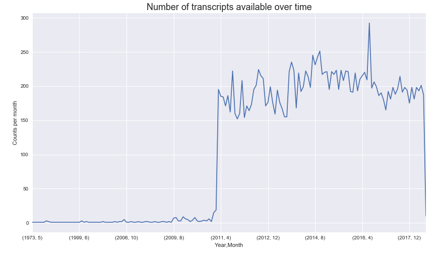
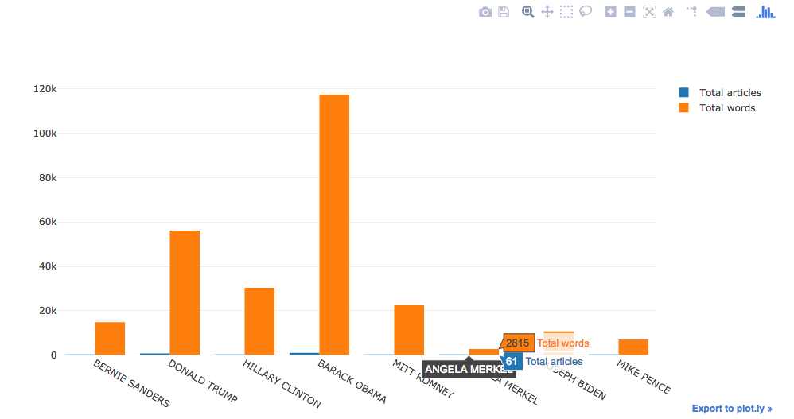
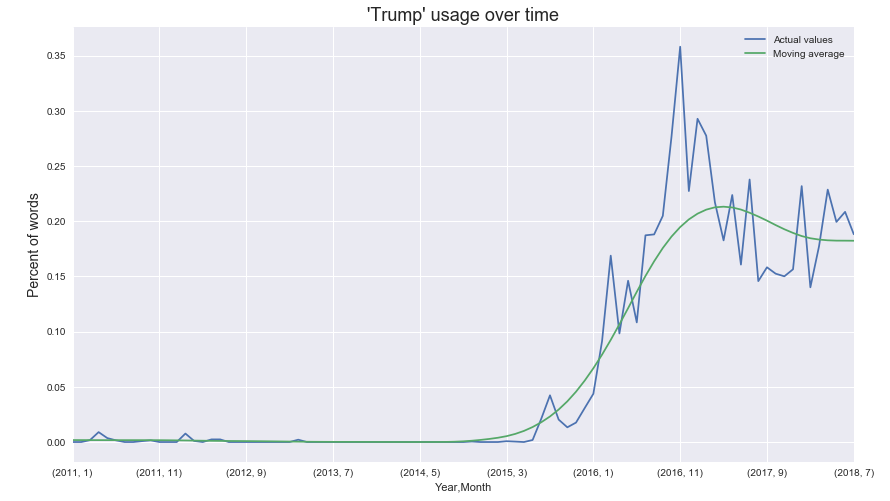
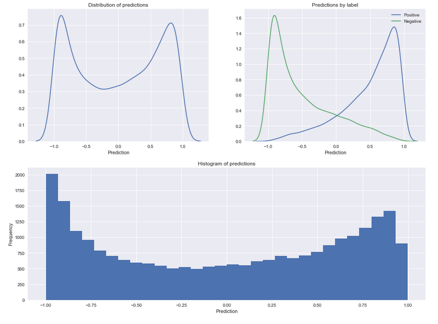

|  | 
|:--:| 

# PBS Newshour - Data Mining and Analysis

Author: Patrick Stetz  [(github)](https://github.com/pstetz/)

# <u>Background</u>

PBS Newshour is an American daily news program currently hosted by Judy Woodruff on the weekdays and Hari Sreenivasan on the weekends.

Below we can see how the 17,617 clips/transcripts are distributed over time. 

The number of transcripts and clips available has signicantly increased since 2011.  This matches the year that Jim Lehrer retired as anchor.

# <u>Data Mining</u>

Code can be found under `scraping/`.

#### Web Scraping

Web Scraping is done through one of Python's libraries, [Beautiful Soup](https://www.crummy.com/software/BeautifulSoup/bs4/doc/)

#### Multiprocessing

Significant time can be saved by using another Python library, [Multiprocessing](https://docs.python.org/2/library/multiprocessing.html)

# <u>Preprocessing</u>

Code can be found under `preprocessing/`.

The preprocessing includes formatting the datetime, speakers, and transcripts.  Speakers were processed to remove titles, qualifiers, and typos so that a one to one relationship between people and names is achieved.  

Transcripts needed as a result of a formatting quirk with PBS Newshour transcripts.  Transcripts don't identify a speaker directly.  Instead speakers are identified with bold text, however this is also used for emphasis.  Fixing this required a very tedious step of manually differentiately bold text from speakers.

# <u>Analysis</u>

Code can be found in the notebook `analysis.ipynb`.

#### Data Overview

#### Sentiment Analysis

I'd like to explore text sentiment in various ways.  It is somewhat tricky to gauge positivity in text.

I decided to train a model on positive movie reviews and negative movie reviews.  Then use this model to gauge the sentiment of political text.

The model is a Light Gradient Boosting model trained on lemmatized words.  These words are selected by limiting the total words so that they're not too common (appear in less than 60% of samples) and not too rare (appear in at least 20 samples).  The model generalizes very nicely to test data and has an 84.6% classification rate.  Below we can see how well the model separates the test data into positive and negative categories.

The hope is that this model extends well to PBS transcript data.

